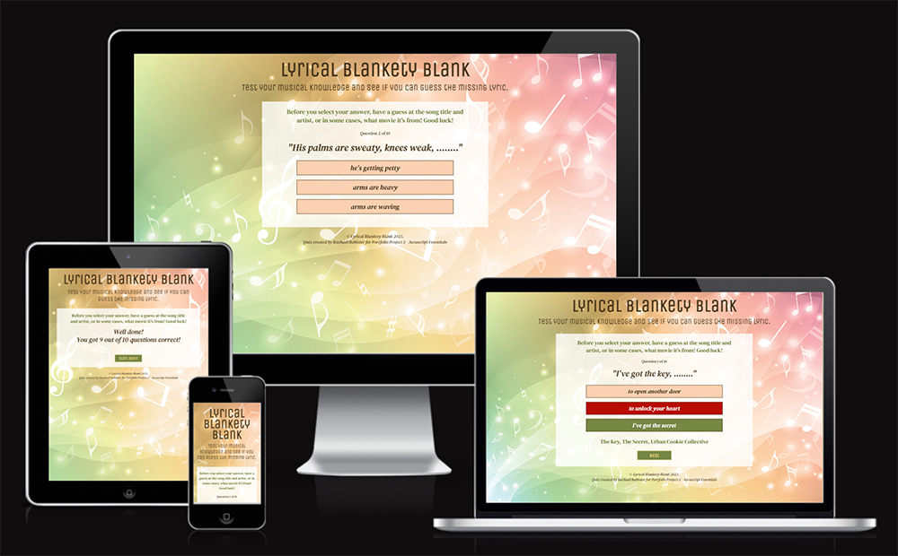
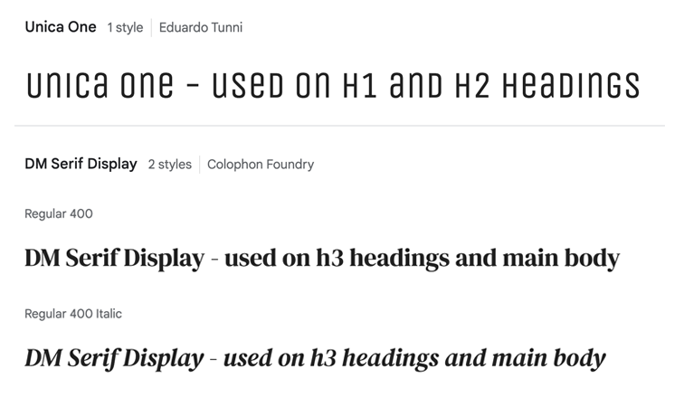
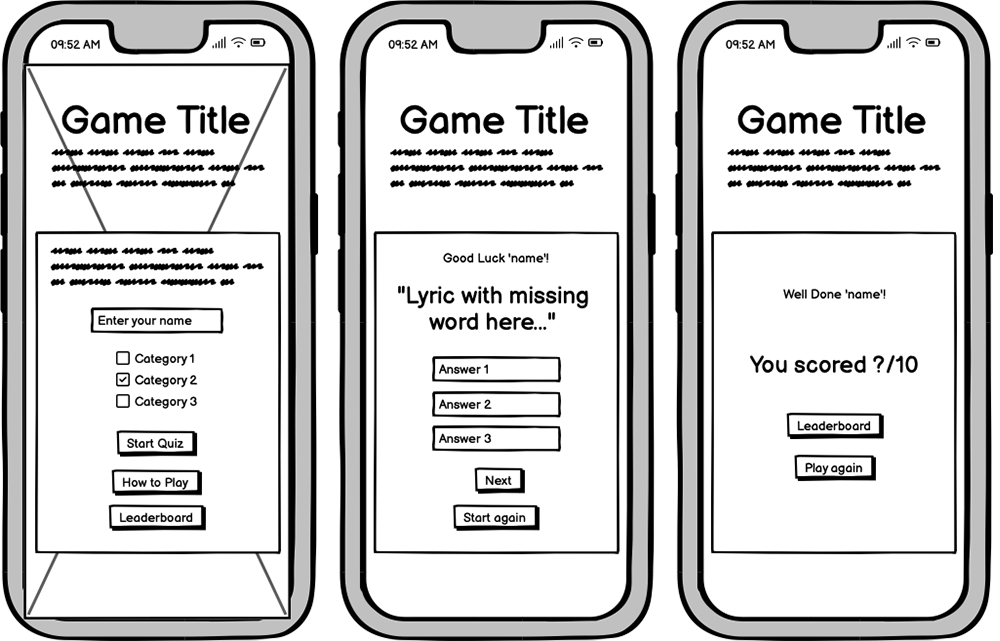
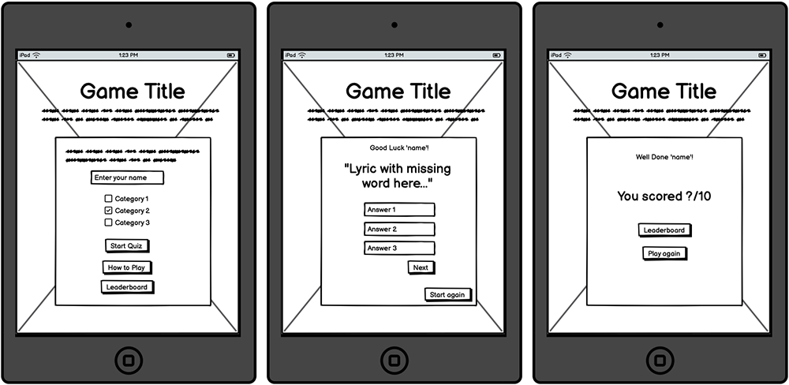
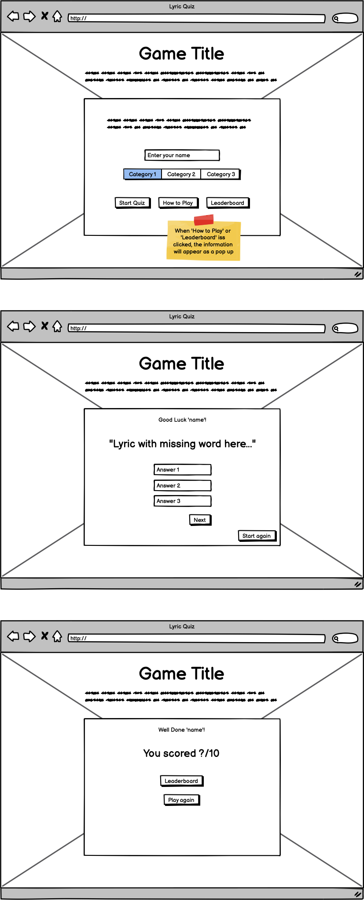

# LYRICAL BLANKETY BLANK

Welcome to the music quiz, Lyrical Blankety Blank. This quiz has been created for users to have a little bit of musical fun, trying to fill in the missing words to 10 song lyrics.

It has been built using HTML, CSS and Javascript to allow the user to interact with the site in a fun and engaging way.

LIVE SITE

[You can view the live site here.](https://rachaelbabister.github.io/lyric-quiz/)

GITHUB PAGES

[You can view the GitHub code pages here.](https://github.com/rachaelbabister/lyric-quiz)

---

## CONTENTS

- [LYRICAL BLANKETY BLANK](#lyrical-blankety-blank)
  - [CONTENTS](#contents)
  - [User Experience (UX)](#user-experience-ux)
    - [User Stories](#user-stories)
      - [Client Goals](#client-goals)
      - [Visitor Goals](#visitor-goals)
  - [Design](#design)
    - [Colour Scheme](#colour-scheme)
    - [Typography](#typography)
    - [Imagery](#imagery)
    - [Wireframes](#wireframes)
  - [Features](#features)
    - [General features on the Quiz](#general-features-on-the-quiz)
      - [Home Page](#home-page)
      - [Gallery](#gallery)
      - [Contact](#contact)
      - [Thank You](#thank-you)
    - [Future Implementations](#future-implementations)
    - [Accessibility](#accessibility)
  - [Technologies Used](#technologies-used)
    - [Languages Used](#languages-used)
    - [Frameworks, Libraries \& Programs Used](#frameworks-libraries--programs-used)
    - [Deployment](#deployment)
    - [Local Development](#local-development)
      - [How to Fork](#how-to-fork)
      - [How to Clone](#how-to-clone)
  - [Testing](#testing)
  - [Credits](#credits)
    - [Code Used](#code-used)
    - [Content](#content)
    - [Media](#media)
    - [Acknowledgments](#acknowledgments)

---

## User Experience (UX)

### User Stories

#### Client Goals

- For users to play an online quiz to test their musical knowledge in song lyrics.
- Be engaging and fun.
- Make it challenging but not so much that they leave the quiz because it's too hard.
- For the user to be able to see their final score at the end.
- For users to see their progress through the quiz so they know how many questions they have left.
- Allow the user to try the quiz again after they get their final score. 

#### Visitor Goals

- I'm looking to play an online quiz that tests my knowledge about a specific subject.
- I want it to be fun and engaging, but not take so long that I get fed up answering questions.
- I'd like to see how long I have left in the quiz.
- I want to see if I get the questions right or wrong.
- I want to know my final score at the end.
- I'd like to be able to play again to potentially beat my score.

---

## Design

### Colour Scheme

The colour scheme for the website came from the background image, which was sourced from [shutterstock.](https://www.shutterstock.com/) I loaded the image into [coolors](https://coolors.co/) and then pulled out just 4 colours and shaded them darker to create better visibility for the site.

### Typography

The fonts were chosen from Google Fonts. I wanted a fun display font and then an easy to read font for the questions. With the heading font being quite modern and unique, I decided to go quite traditional with a serif font for the body in contrast.

Google Fonts was used to import both fonts:

- Unica One is a cursive font used on h1 and h2 headings. This is a single weight font.
- DM Serif Display is serif font used on h3 headings and the main body of the website. It also has a single weight font, but does have an italic style.

### Imagery

There is just the one image used on the website, which is the background image. It was chosen to represent the musical theme of the quiz, and it felt bright and fresh. I used Canva to create a random musical image for the favicon of the website.

- Background image

- Favicon
  

### Wireframes

I created Wireframes for mobile, tablet and desktop using [Balsamiq.](https://balsamiq.com/)

Mobile Phone Wireframe

Tablet Wireframe

Desktop Wireframe

I was aiming high when I created the wireframes for this project, wanting to be able to add lots of functions into the quiz. However, when it came to putting it all together, I realised I had perhaps been slightly over ambitious! I have found learning Javascript very challenging, and so I downscaled my project to be able to do the best I could with fewer functions, whilst still being able to show all that I have learnt.

Keeping that all in mind, I still tried to keep the design as close to the wireframes as possible.

---

## Features

The quiz is just a one page website, with all functionality running through Javascript. The page has been designed to be responsive.

### General features on the Quiz

- Favicon
  - The site has a favicon which is shown in the web browser and if a user was to bookmark the page, it enables the site to be instantly recognised and selected.

- Game Area
  - 

#### Home Page

The home page features a bright hero image of some cupcakes and a treat box directly underneath the navigational header. There is some welcome text underneath, which introduces the baker and where they're based.

The next section is broken down into images and text, to showcase some of the cakes and treat boxes, and gives the user ideas as to what they can order and for who.

Just above the footer there is another image banner with a call to action to take you to the contact page.

#### Gallery

In this top section below the menu header, it starts by asking if the user needs inspiration and to take a look at the gallery. There are 3 anchor links (cakes, cupcakes and treat boxes) which when clicked take you to the appropriate part of the gallery.

The same call to action banner is also at the bottom above the footer.

#### Contact

To bring some colour and interest to this page there is a colourful cake banner image below the menu section. It invites users to get in touch using the contact form. Some elements are required before the form can be submitted, and users do get alerted when they haven't filled in these elements.

#### Thank You

A simple page with the same styling as the Contact page. The form elements have been removed and replaced with a 'thank you for submitting' message.

### Future Implementations

- A new page with standard pricing and examples of cakes and their pricing.
- An information page giving users cake care and cutting guides.
- A suppliers page - recommendations of where to buy supplies.
- A 'recipe' page which details flavours available for sponge and fillings, and what options of treat boxes are available.
What features would you like to implement in the future on your site? Would you like to add more pages, or create login functionality? Add these plans here.

### Accessibility

I have tried to ensure the site has been made as accessible as possible by:

- Using semantic HTML.
- Using alt attributes on images where available.
- Adding aria-labels for screen labels.
- Using colour contrasts between the text and background.

---

## Technologies Used

### Languages Used

HTML and CSS were used to create this website.

### Frameworks, Libraries & Programs Used

- [Balsamiq](https://balsamiq.com/) - to create Wireframes.
- [Codeanywhere](https://app.codeanywhere.com/) - cross platform cloud IDE to deploy workspace environment to Github.
- [Github](https://github.com/) - to store and dislay all files and assets for the website.
- [Google Fonts](https://fonts.google.com/) - to import the fonts used on the website.
- [Font Awesome](https://fontawesome.com/icons) - to use icons on the website.
- [Google Dev Tools](https://developer.chrome.com/docs/) - to troubleshoot, test and solve issues with any styling.
- [W3C Markup Validator](https://validator.w3.org/) - to check the source code of my html files for any bugs.
- [W3C CSS Validator](https://jigsaw.w3.org/css-validator/) - to check the source code of my css file for any bugs.
- Photoshop 2023 - to optimise images for the website.
- [Am I Responsive?](https://ui.dev/amiresponsive?) - to showcase the website on different devices.

Add any frameworks, libraries or programs used while creating your project.

### Deployment

I used Github Pages to deploy the live website. To deploy a website on Github, follow these steps:

1. Log in to Github - or set up a new account.
2. Find the repository for [Blush Bakes by Rach](https://github.com/rachaelbabister/blush-bakes-by-rach).
3. Click on 'Settings' along the top.
4. Click on 'Pages' in the left hand side navigation bar.
5. In the 'Source' section, ensure 'Deploy from a branch' is selected. Choose 'main' and 'Root' from the drop down menus and click Save.
6. Your live site is now deployed and can be viewed using the link provided.

### Local Development

#### How to Fork

To fork a repository on Github, follow these steps:

1. Log in to Github - or step up a new account.
2. Click on the repository for [Blush Bakes by Rach](https://github.com/rachaelbabister/blush-bakes-by-rach).
3. Click the Fork button in the top right corner.

#### How to Clone

To clone a repository on Github, follow these steps:

1. Log in to Github - or step up a new account.
2. Find the repository for [Blush Bakes by Rach](https://github.com/rachaelbabister/blush-bakes-by-rach).
3. Click on the code button, select whether you would like to clone with HTTPS, SSH or GitHub CLI and copy the link shown.
4. Open the terminal in your code editor and change the current working directory to the location you want to use for the cloned directory.
5. Type 'git clone' into the terminal and paste the link you copied in step 3. Press enter.

- - -

## Testing

I have learnt from this project to ensure I start my TESTING file from the begining in future. I continually test the site as I go along and have fixed many small issues that didn't work straight away, but unfortunately these weren't catalogued.

In the TESTING file linked below, you can see the tests and fixes I did manage to catalogue.
  
[TESTING.md file](TESTING.md)

---

## Credits

### Code Used

- [W3Schools](https://www.w3schools.com/howto/howto_css_transition_hover.asp) - helped to style my buttons to have a smoother transition. I also used them for a Font Awesome tooltip, but have since removed the element that used it.
- [W3Docs](https://www.w3docs.com/snippets/css/display-the-hidden-element-on-hovering-over-hyperlink-or-a-tag.html) - helped to display an element on hover.
- [RapidTables](https://www.rapidtables.com/convert/color/hex-to-rgb.html) - converting hex colours to rgb values.
- [Stack Overflow](https://stackoverflow.com/questions/51893686/css-columns-fill-row-first) - helped to style my gallery page so that the columns filled the rows across first, rather than down.
- [Free Code Camp](https://www.freecodecamp.org/news/css-only-back-to-top-button/) - helped to code the 'back to top' button using only html and css.
- [W3Docs](https://www.w3docs.com/tools/code-editor/3033) - styling to increase the checkbox size in the contact form.
- [Soft Author](https://softauthor.com/css-flexbox-responsive-registration-form-with-source-code/) - used the code in order to help make the contact form responsive by having the form elements go into two columns on a bigger screen.
- I also used the [Love Running](https://rachaelbabister.github.io/loverunning/) project I created with [Code Institute](https://codeinstitute.net/) to help with some coding.

### Content

All content used on the site was written by Rachael Babister.

### Media

All photos were taken by Rachael Babister and are originals. Icons used on the site are Font Awesome icons.
  
### Acknowledgments

I would like to thank the following people for their help, whether directly or indirectly!

- My two daughters who have been very patient with me whilst doing this project, and helping to walk the dog and clean the house!
- My Code Institute Mentor [Jubril Akolade](https://www.linkedin.com/in/jubrillionaire/?originalSubdomain=ca).
- Members of the Code Institute Slack community. Although I didn't ask any direct questions for help, when searching for little queries, I always managed to find the answer!
- My friend Victoria Walters who has had to listen to me chat about code for far too long! And for looking over my site and checking for errors.
- My friend Kelly Bates who knows nothing about code but still happily looked through my live site for me checking for any issues - and bringing some to my attention!
- [Stuart Crang](https://www.linkedin.com/in/stuart-crang-50401897/) from Code Institute who signed me up to the course! I hope you like my first project!
