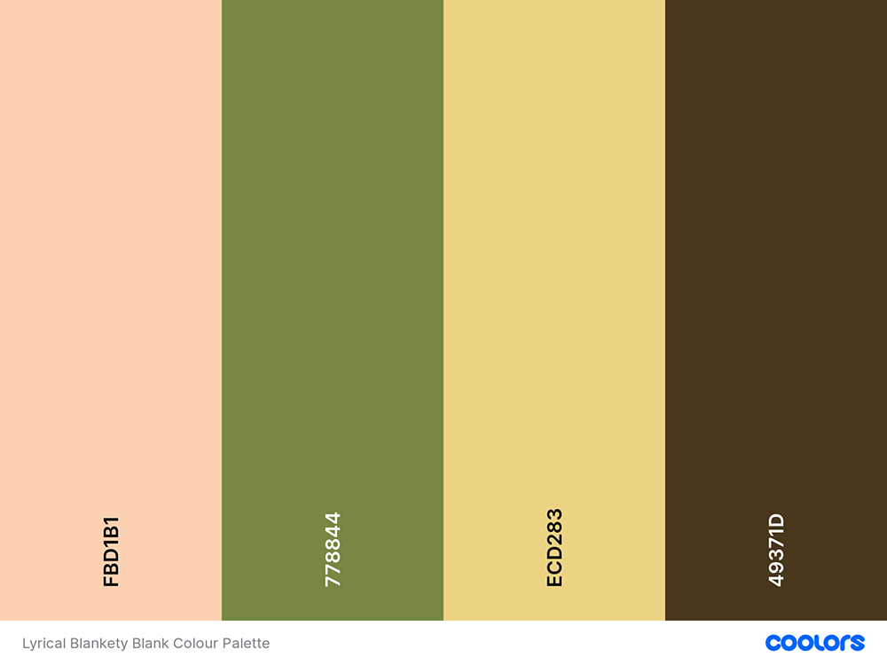
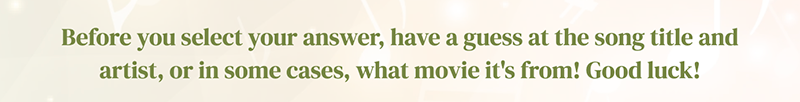

# LYRICAL BLANKETY BLANK

Welcome to the music quiz, Lyrical Blankety Blank. This quiz has been created for users to have a little bit of musical fun, trying to fill in the missing words to 10 song lyrics.

It has been built using HTML, CSS and JavaScript to allow the user to interact with the site in a fun and engaging way.

LIVE SITE

[You can view the live site here.](https://rachaelbabister.github.io/lyric-quiz/)

GITHUB PAGES

[You can view the GitHub code pages here.](https://github.com/rachaelbabister/lyric-quiz)

---

## CONTENTS

- [LYRICAL BLANKETY BLANK](#lyrical-blankety-blank)
  - [CONTENTS](#contents)
  - [User Experience (UX)](#user-experience-ux)
    - [Client Goals](#client-goals)
    - [Visitor Goals](#visitor-goals)
  - [Design](#design)
    - [Colour Scheme](#colour-scheme)
    - [Typography](#typography)
    - [Imagery](#imagery)
    - [Wireframes](#wireframes)
  - [Features](#features)
    - [Favicon](#favicon)
    - [Game Title](#game-title)
    - [Game Area](#game-area)
    - [Intro Text](#intro-text)
    - [Questions](#questions)
    - [Answers](#answers)
    - [Results](#results)
    - [Future Implementations](#future-implementations)
  - [Technologies Used](#technologies-used)
    - [Languages Used](#languages-used)
    - [Frameworks, Libraries \& Programs Used](#frameworks-libraries--programs-used)
    - [Deployment](#deployment)
    - [Local Development](#local-development)
      - [How to Fork](#how-to-fork)
      - [How to Clone](#how-to-clone)
  - [Testing](#testing)
  - [Credits](#credits)
    - [Code Used](#code-used)
    - [Content](#content)
    - [Media](#media)
    - [Acknowledgments](#acknowledgments)

---

## User Experience (UX)

### Client Goals

- For users to play an online quiz to test their musical knowledge in song lyrics.
- Be engaging and fun.
- Make it challenging but not so much that they leave the quiz because it's too hard.
- For the user to be able to see their final score at the end.
- For users to see their progress through the quiz so they know how many questions they have left.
- Allow the user to try the quiz again after they get their final score. 

### Visitor Goals

- I'm looking to play an online quiz that tests my knowledge about a specific subject.
- I want it to be fun and engaging, but not take so long that I get fed up answering questions.
- I'd like to see how long I have left in the quiz.
- I want to see if I get the questions right or wrong.
- I want to know my final score at the end.
- I'd like to be able to play again to potentially beat my score.

---

## Design

### Colour Scheme

The colour scheme for the website came from the background image, which was sourced from [shutterstock.](https://www.shutterstock.com/) I loaded the image into [coolors](https://coolors.co/) and then pulled out just 4 colours and shaded them darker to create better visibility for the site.

### Typography

The fonts were chosen from Google Fonts. I wanted a fun display font and then an easy to read font for the questions. With the heading font being quite modern and unique, I decided to go quite traditional with a serif font for the body in contrast.

Google Fonts was used to import both fonts:

- Unica One is a cursive font used on h1 and h2 headings. This is a single weight font.
- DM Serif Display is serif font used on h3 headings and the main body of the website. It also has a single weight font, but does have an italic style.

### Imagery

There is just the one image used on the website, which is the background image. It was chosen to represent the musical theme of the quiz, and it felt bright and fresh. I used Canva to create a random musical image for the favicon of the website.

- Background image

- Favicon
  

### Wireframes

I created Wireframes for mobile, tablet and desktop using [Balsamiq.](https://balsamiq.com/)

Mobile Phone Wireframe

Tablet Wireframe

Desktop Wireframe

I was aiming high when I created the wireframes for this project, wanting to be able to add lots of functions into the quiz. However, when it came to putting it all together, I realised I had perhaps been slightly over ambitious! I have found learning JavaScript very challenging, and so I downscaled my project to be able to do the best I could with fewer functions, whilst still being able to show all that I have learnt.

Keeping that all in mind, I still tried to keep the design as close to the wireframes as possible.

---

## Features

The quiz is just a one page website, with all functionality running through JavaScript. The page has been designed to be responsive.

### Favicon
- The site has a favicon which is shown in the web browser and if a user was to bookmark the page, it enables the site to be instantly recognised and selected.

### Game Title
- The game title is static and stays visible on the page throughout the duration of the quiz.

### Game Area
- The game area is contained in a transparent white box, with some intro copy, a question counter, the question and then 3 multiple choice answers.

### Intro Text
- The introductory text is a small static paragraph which stays visible through the whole game. It suggests to users to think about what the song title is before selecting their answer.

### Questions
- The question area shows the question to be answered, and also a counter just above, for the user to see how far they are in the quiz.
- There are 15 questions in total which are shuffled each time a user plays, however they only answer 10 questions per game.

### Answers
- The three multiple choice answers are presented in a box/button format, with a shadow hover.
- When the user selects an answer, it will change to green if they got question right, or red if they got the question wrong.
- After the user has chosen their answer, the song title and artist appears underneath the answer boxes.
- A 'next' box will also appear, allowiing the user to move on to the next question.

### Results
- Once the user has answered all 10 questions, the results replace the quiz, congratulating them and showing how many questions out of 10 they got correct.
- They can also choose to play again, by clicking on the Start Again button.

### Future Implementations

- It would be great to introduce the functions that I originally wanted to include from my wireframe:-
  - A text input for users to enter their name.
  - Three categories of music to choose from.
  - A 'how to play' section that appears over the top of the game, with a close button to reveal the game again.
  - A leaderboard of the top 10 players and their scores.

---

## Technologies Used

### Languages Used

HTML, CSS and JavaScript were used to create this interactive online game.

### Frameworks, Libraries & Programs Used

- [Balsamiq](https://balsamiq.com/) - to create Wireframes.
- [Codeanywhere](https://app.codeanywhere.com/) - cross platform cloud IDE to deploy workspace environment to Github.
- [Github](https://github.com/) - to store and dislay all files and assets for the website.
- [Google Fonts](https://fonts.google.com/) - to import the fonts used on the website.
- [Google Dev Tools](https://developer.chrome.com/docs/) - to troubleshoot, test and solve issues with any styling.
- [W3C Markup Validator](https://validator.w3.org/) - to check the source code of my html files for any bugs.
- [W3C CSS Validator](https://jigsaw.w3.org/css-validator/) - to check the source code of my css file for any bugs.
- [JSHint](https://jshint.com/) - to check the JavaScript code for any bugs.
- Photoshop 2023 - to optimise images for the quiz and this README file.
- [Am I Responsive?](https://ui.dev/amiresponsive?) - to showcase the website on different devices.

### Deployment

I used Github Pages to deploy the live website. To deploy a website on Github, follow these steps:

1. Log in to Github - or set up a new account.
2. Find the repository for [Lyrical Blankety Blank](https://github.com/rachaelbabister/lyric-quiz) (the repository for the quiz is called 'lyric-quiz').
3. Click on 'Settings' along the top.
4. Click on 'Pages' in the left hand side navigation bar.
5. In the 'Source' section, ensure 'Deploy from a branch' is selected. Choose 'main' and 'Root' from the drop down menus and click Save.
6. Your live site is now deployed and can be viewed using the link provided.

### Local Development

#### How to Fork

To fork a repository on Github, follow these steps:

1. Log in to Github - or step up a new account.
2. Find the repository for [Lyrical Blankety Blank](https://github.com/rachaelbabister/lyric-quiz) (the repository for the quiz is called 'lyric-quiz').
3. Click the Fork button in the top right corner (below where 'Settings' is).

#### How to Clone

To clone a repository on Github, follow these steps:

1. Log in to Github - or step up a new account.
2. Find the repository for [Lyrical Blankety Blank](https://github.com/rachaelbabister/lyric-quiz) (the repository for the quiz is called 'lyric-quiz').
3. Click on the code button, select whether you would like to clone with HTTPS, SSH or GitHub CLI and copy the link shown.
4. Open the terminal in your code editor and change the current working directory to the location you want to use for the cloned directory.
5. Type 'git clone' into the terminal and paste the link you copied in step 3. Press enter.

- - -

## Testing

In the TESTING file linked below, you can see the tests and bug fixes I carried out on this site.
  
[TESTING.md file](TESTING.md)

---

## Credits

### Code Used

- [Sitepoint](https://www.sitepoint.com/simple-javascript-quiz) - a guide to help me get started with creating a quiz.
- [W3Schools](https://www.w3schools.com) - I used this website to help with the following elements:
  - CSS Box Shadow
  - DOM Elements
  - JavaScript const (to remind myself when to use this over let)
  - JavaScript Array from() Method
- [Medium](https://medium.com/geekculture/creating-counter-with-javascript-4b1c60892c45) - guided me in working out how to create the question counter.
- [Horns on Fire](https://tanisecarvalho.github.io/horns-on-fire/) - I looked through the source code of a fellow Code Institute student to help with how to separate my long list of question arrays to my main javascript file; code for the next button; and shuffle questions.
- [Stack Overflow](https://stackoverflow.com/questions/5484560/javascript-if-else-statement-to-hide-and-show-div) - guided me to better understand using an if else statment to hide and show divs.
- [Slack Community](https://app.slack.com/) - I asked for help on Slack when I was trying to create the 'How to Play' section, however this didn't make it into the final project.

### Content

Introductory copy used on the site was written by Rachael Babister. Song Lyrics written by their respective Artists/song writers.

### Media

The background image was purchased from [Shutterstock](https://www.shutterstock.com/), and the favicon icon came from Canva.
  
### Acknowledgments

Yet again, I need to thank my amazing daughters who are very patient when I snap at them after struggling with trying to get something to work, and for getting me food and making lots of cups of tea. They also helped gather together the lyrics for the quiz, as did my close friends who also gave me their favourite songs, and then tested the site for me and gave me great feedback to make me feel like it is all worth it! ;)