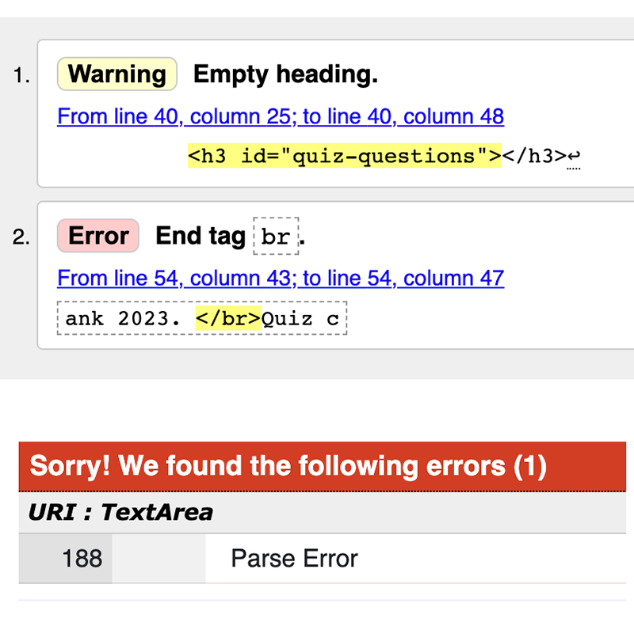
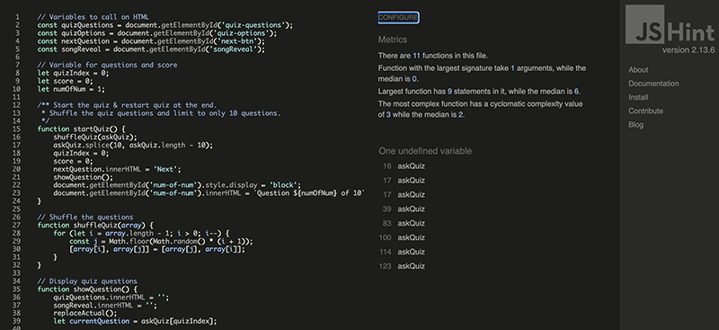
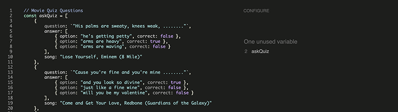
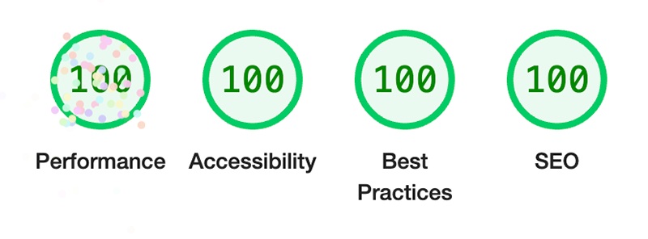
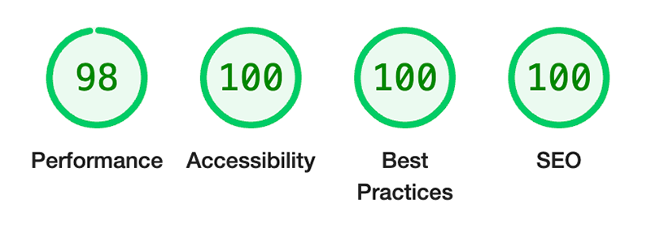

# LYRICAL BLANKETY BLANK - TESTING

LIVE SITE

[You can view the live site here.](https://rachaelbabister.github.io/lyric-quiz/)

## CONTENTS

- [LYRICAL BLANKETY BLANK - TESTING](#lyrical-blankety-blank---testing)
  - [CONTENTS](#contents)
  - [AUTOMATED TESTING](#automated-testing)
    - [W3C Validator](#w3c-validator)
    - [JSHint Validator](#jshint-validator)
    - [Lighthouse](#lighthouse)
      - [Desktop Results](#desktop-results)
      - [Mobile Results](#mobile-results)
  - [MANUAL TESTING](#manual-testing)

Testing was carried out during the development of the site. This was where the realisation came that perhaps my initial functionality ideas were slightly too ambitious, as despite searching for help with some of the functions, I couldn't get them to work - and couldn't understand why. I wanted to create a quiz whereby I understood how the functions worked, and so came about this version.

Chrome Developer Tools was very useful to bug the code and inform me where things may have been going wrong.

I used the W3C Validator to check my html and css source code, JSHint to check my JavaScript code, and also LightHouse within Chrome Developer Tools to test the performance and accessibility. These are explained in more detail below.

- - -

## AUTOMATED TESTING

### W3C Validator

[W3C](https://validator.w3.org/) was used to validate the source code for both the HTML and CSS.

The first check revealed a couple of minor errors. I fixed these by:
- Entering a heading of 'Questions' in the h3 heading.
- Removing the forward slash from the br tag.

Once these bugs were fixed, the validators return no errors.

- [Quiz Page HTML](https://validator.w3.org/nu/?doc=https%3A%2F%2Frachaelbabister.github.io%2Flyric-quiz%2Findex.html)
- [Quiz Page CSS](https://jigsaw.w3.org/css-validator/validator?uri=https%3A%2F%2Frachaelbabister.github.io%2Flyric-quiz%2Fassets%2Fcss%2Fstyle.css&profile=css3svg&usermedium=all&warning=1&vextwarning=&lang=en)

### JSHint Validator

[JSHint](https://jshint.com/) was used to validate the source code for JavaScript.

- script.js
  - The undefined variable 'askQuiz' is defined on the questions.js file declared on the index.html before script.js.

- questions.js
  - The unused variable 'askQuiz' is a function used on the script.js file.

- - -

### Lighthouse

I used Lighthouse within the Chrome Developer Tools to test the performance, accessibility, best practices and SEO of the site.

#### Desktop Results

Very happy to see the desktop results had 100 all round, and the celebratory confetti Lighthouse gave it!
  

#### Mobile Results

Good high results on mobile as well. Happy to see green.

---

## MANUAL TESTING

Whilst working on the project, I fixed a few bugs that were found when using Chome Developer Tools:-

- questions.js
  - on the askQuiz variable, I had omitted to use a comma after the closed square bracket on the answer element. Once this was added, the function worked.

- Song & Artist
  - I was working on getting the song title and artist to appear when the user clicked their answer, which it did. However when the 'Next' button was clicked the previous song title and artist was still showing. I need to clear the previous and did this by adding the code songReveal.innerHTML = '';

- Question Counter
  - The question counter was working well, however when the user selected 'Start again' at the end of the quiz, it didn't start back at 1, it went to 11/10. I needed to add in the code askQuiz.length - 10 to get this to work. I also needed to re-order the code within the function nextButton so that numOfNum appeared before quizIndex.

- Meta Tags
  - On my first run through Lighthouse, I had omitted to add the meta tags for SEO, so these were added in order to achieve 100.

The site was tested by friends and also on the Slack Community. No issues or bugs were reported, however:

- Slack Community
  - It was suggested that the background image was too bright and to try adding a transparency to the image. I tried this, but decided that it looked better with the brighter image.
  - It was suggested I add a link to my Github profile in the footer, and so this was added.

Back to [README.md](README.md)

